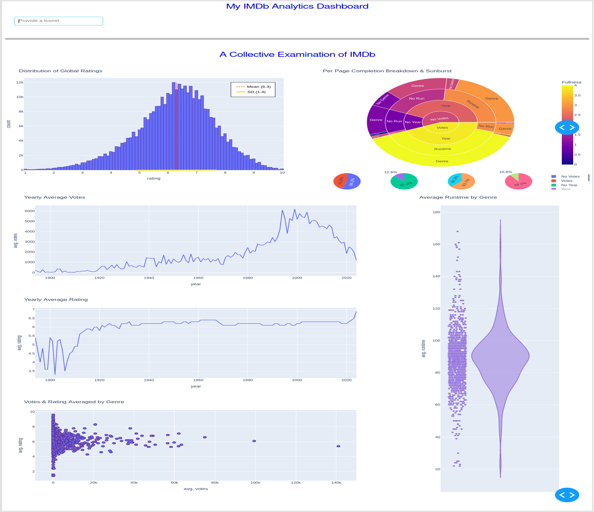
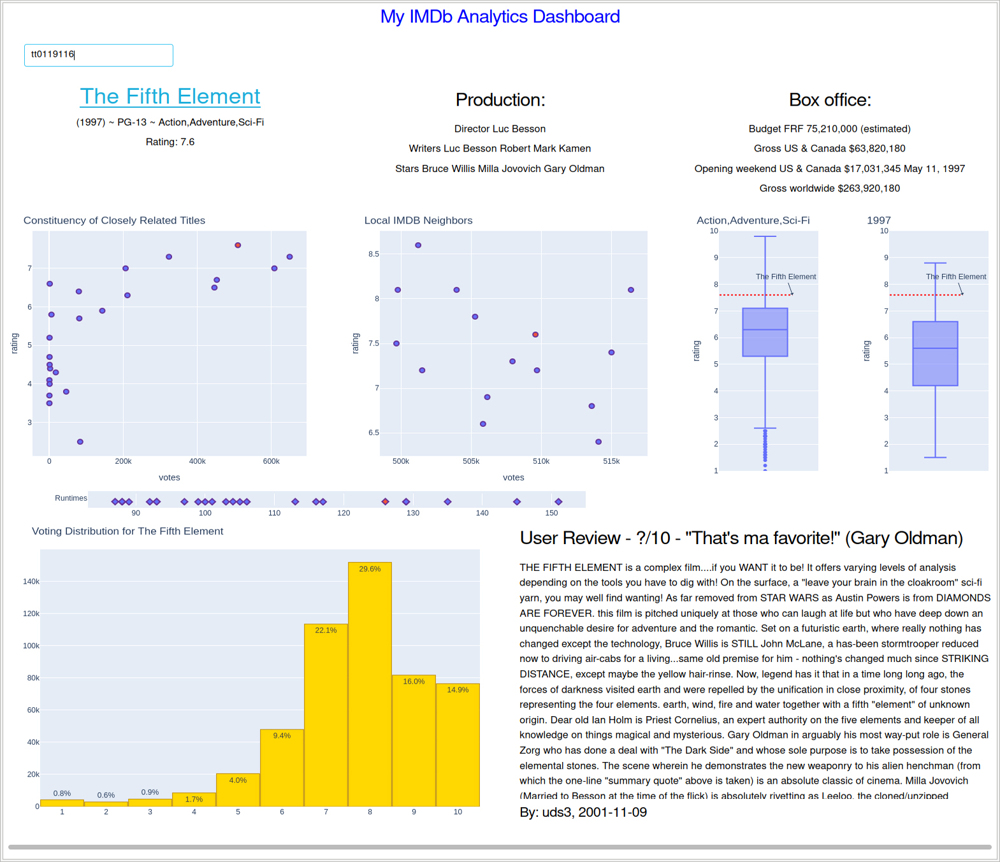

## Explore Movies With Data

[I made this programming project to develop a visualization tool which can be used to gain broader insights about movies through the information available from IMDb.](https://github.com/SDeanEgan/movie-dash-app) The tool is intended to help users considering watch recommendations, hobbyists looking to relate their experience with broader insights, and those questioning what the potential will be for a title. A tool like this can also help its users make more objective choices when engaging with IMDb.  

The result of the project is a functional analytics dashboard, which is served to users as a web application. It's written in the Python programming language and uses the Flask web framework as well as the pandas and Dash by Plotly libraries to process the dataset and generate visualizations. Dash itself uses the Flask web framework to generate the underlying server, making it simpler for developers to create and deploy interactive dashboards. Some data is also required from the IMDb website directly to produce Title views, which involves web scraping performed via the urllib, json, and BeautifulSoup4 libraries. These proved an invaluable portion of the overall functionality.

[The current core dataset is the **IMDb Non-Commercial Datasets**.](https://developer.imdb.com/non-commercial-datasets/) A series of datasets provided for free by IMDb to allow for hobbyist analysis and historic interpretations. As an extension to the non-commercial dataset, it became necessary to source data dynamically from IMDb for a distribution breakdown of existing user votes on titles. In addition, IMDb lacks financial data in their free datasets, such as budgets and gross, or any inclusion of existing user review data. This can be accessed directly via pages associated with the title, so functionality has been included to incorporate them. 

### The app provides its collection of visualizations under two organizations or “views”. The first is the Historic view, used to greet users each time the application is accessed.

### The second are Title views, which users can access by searching on the dashboard where they have a specific title in mind.

### If you'd like to give it a try:
 - Install the Python packages dash, pandas, and beautifulsoup4, as well as their associated dependencies (this will include flask, plotly.express, numpy, etc.).
 - Keep the python file and assets folder stored under the same directory, and run the app from the command line with `python app.py`. Flask should indicate that "Dash is running on http://127.0.0.1:8050/". Just open this link from your web browser.
 - try using the search bar with a movie's IMDb tconst identifier. That's the code featured at the end of any IMDb movie page URL. For example, use tt0119116 from www.imdb.com/title/tt0119116/.

Overall, I am very satisfied with the results, though there are some performance concerns as the size of the data used is fairly significant. Nearly all of the originally proposed functionality for the project proved feasible by the end. Some of which may have been a matter of coincidence, but is largely due to the maturity of the libraries used and the wide availability of helpful information online surrounding them. In the end, the project has allowed me to gain experience in visual analysis and design as well as several new information processing and presentation libraries for Python.
